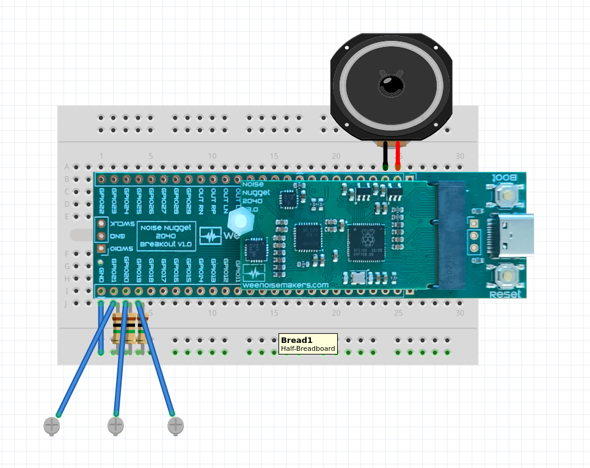

# Noise Nugget 2040 Breakout - Touch Synth Example

This example is one of simplest projects you can make on the Noise Nugget 2040
Breakout. Using capacitive sensing, touching one of the 3 screws will trigger a
sound to be played on the speaker.

Part list:
 - 1 x [Noise Nugget 2040 Breakout](https://weenoisemakers.com/noise-nugget-2040/#breakout)
 - 1 x breadboard
 - 3 x 1Mohm resistors
 - 3 x Screws (or any metalic objects)
 - 1 x speaker
 - A few pieces of wire

# Assembly



 - Start by pressing the Noise Nugget 2040 Breakout on the breadboard. Make
   sure the Breakout is centered so one line of connectors is available on each
   side.
 - Place a jumper wire between the GND pin of the Breakout (bottom left on the
   picture above) and a ground rail.
 - Place 1Mohm resistors from GPIO21 and the ground rail.
 - Repeat for GPIO20 and GPIO19.
 - Take 3 piece of wire (10 to 20 cm long) and wrap stip a little bit of
   insulation on one end (1cm), then strip a long bit of insulation on the
   other end (5cm).
 - For each wire, wrap the long bare wire around one of the screws
 - Take one of the wire + screw and plug the short end it into the GPIO21
   socket (both the resistor lead and wire should fit in one socket)
 - Repeat for GPIO20 and GPIO19.
 - Plug the black speaker wire on the "Right Speaker -" pin
 - Plug the red speaker wire on the "Right Speaker +" pin

That's it for assembly. To make the project more robust, you can place all the
components in a cardboard box and poke the screw heads through the top of the
box.

# Code (Circuitpython)

This example is based on CircuitPython. Your Noise Nugget 2040 Breakout should
already have CircuitPython installed. We recommend installing the Mu editor for
best experience: [https://codewith.mu/](https://codewith.mu/).

Plug the Noise Nugget Breakout to your computer using a good quality USB cable.
The board should show up on your computer as a USB drive called "CIRCUITPY".
Using the Mu editor, open the file "code.py" inside the "CIRCUITPY" drive. Then
copy and paste the following code into the editor:

```python
```

Save the file. The board will now restart and after a few seconds you can touch
the screw heads to trigger sounds.
